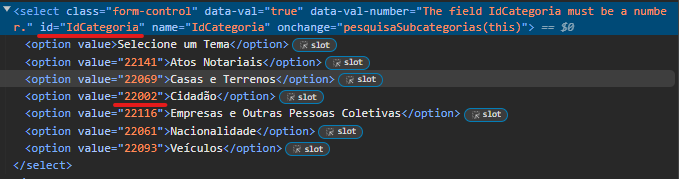

# Configurations

## Batch searching for one or more configuration(s)
### Create an yaml file in the root folder named seach_config.yaml
#### Use the following syntaxe:
```
- search:
    title: 'IRN Registo'
    start_time: '07:00'
    end_time: '23:59'
    max_days: 7
    frequency: 5
    entity_opt: 176
    service_opt:
      tema: 22002
      subtema: 22003
      motivo: 22705
    location_opt:
      distrito: 11
      localidade: 17
      local_atendimento: 591
```
* Title, start time and end time are optionals.
  * Start and End time are used to limit the search between those hours.
* Max Days -> Threshold of days to look for available time slots
* Entity -> You need to provide the button ID in the HTML element:

* Frequence in minutes -> Interval to search for time slots.
* For the properties "service" and "location": You need to provide the value available in the HTML element:


## Telegram configuration
### Send messages via telegram
* It can send messages via Telegram Bot.
#### Create an .env file in the root folder containing the following variables
```bash
BOT_TOKEN = {TOKEN FROM YOUR TELEGRAM BOT}
BOT_CHAT_ID = {CHAT ID FROM YOUR CONVERSATION WITH THE BOT}
```
#### In order to get the group chat id, do as follows:
1) Add the Telegram BOT to the group.

2) Open the following URL:

```bash
https://api.telegram.org/bot<YourBOTToken>/getUpdates
```
3) Send any message to your Bot

4) Go back to the browser and refresh it. Look for the "chat" object:
```bash
{
    "update_id": 8393,
    "message": {
        "message_id": 3,
        "from": {
            "id": 7474,
            "first_name": "AAA"
        },
        "chat": {
            "id": <group_ID>,
            "title": "<Group name>"
        },
        "date": 25497,
        "new_chat_participant": {
            "id": 71,
            "first_name": "NAME",
            "username": "YOUR_BOT_NAME"
        }
    }
}
```
